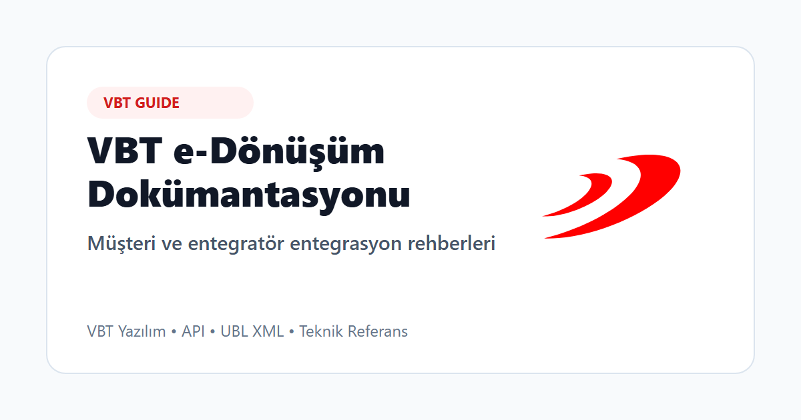

# VBT e-Dönüşüm Dokümantasyonu

Bu repo, VBT e-Dönüşüm ürünleri için hazırlanan müşteri ve entegratör entegrasyon rehberlerini içerir. Rehberler; ürünün iş kapsamını, teknik entegrasyon adımlarını, API kullanımını, örnek request yapılarını, UBL XML eşleştirmelerini ve sıkça sorulan soruları tek bir yerde toplar.

## Mevcut rehberler

- [e-Gider Pusulası Entegrasyon Rehberi](guides/e-gider-pusulasi/index.html)
- [e-Müstahsil Makbuzu Entegrasyon Rehberi](guides/mustahsil-makbuzu/index.html)
- [e-Serbest Meslek Makbuzu Entegrasyon Rehberi](guides/serbest-meslek-makbuzu/index.html)

## Kimler için?

Bu dokümantasyon aşağıdaki ekiplerin entegrasyon sürecinde güvenilir ve güncel referans olarak kullanması için hazırlanmıştır:

- VBT e-Dönüşüm ürünlerini kullanan müşteriler
- VBT ürünleriyle entegrasyon geliştiren entegratör firmalar
- API, UBL XML, test ve canlı ortam geçiş süreçlerinde çalışan teknik ekipler
- Yazılım geliştirme, analiz, test ve operasyon ekipleri

## Nasıl kullanılır?

Önce entegrasyon yapılacak ürüne ait rehberden başlayın. Her ürün rehberi, konu başlıklarını ürünün iş akışı ve teknik entegrasyon sırasına göre düzenler.

Rehber içinde özellikle şu bölümleri takip edebilirsiniz:

- Ürünün kapsamı ve temel kullanım senaryoları
- Platform, entegratör ve GİB sorumlulukları
- API endpoint referansı
- Request örnekleri
- Request ile UBL XML alan eşleştirmeleri
- Teknik referans, changelog ve sıkça sorulan sorular

Sorularınız veya destek talepleriniz için merkezi [Çözüm Merkezi](iletisim.html) sayfasını kullanabilirsiniz.

## Destek ve iletişim

Destek e-postası, destek telefonu, destek portalı, test portalı ve kurumsal site bağlantıları [Çözüm Merkezi](iletisim.html) sayfasında yer alır.

Entegrasyon sürecinde bir hata, eksik bilgi veya belirsizlikle karşılaşırsanız, ilgili ürün rehberindeki teknik referans ve SSS sayfalarını kontrol ettikten sonra destek kanalları üzerinden VBT ekibiyle iletişime geçebilirsiniz.

## Yayın adresi

Bu dokümantasyon müşteri erişimine açık statik dokümantasyon olarak yayınlanır:

[https://vbtyazilim.github.io/](https://vbtyazilim.github.io/)
